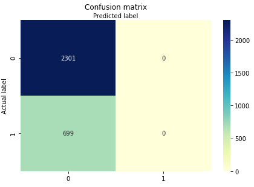

# Employee Retention Project Description
Organizations are now focusing more and more on employee attrition and are trying to identify all possible reasons behind it. 
This project aims to analyse the employee turnover motives, and it investigates the most effective factors on employees leaving the organization. The objective of this project is to classify employees whether they will leave the organization or not based of a couple of inputs.
This dataset contains several factors related to employee churn such as satisfaction level, last evaluation, salary, department, …etc.
First of all, the dataset was explored on a high level to get a general idea about it.
The satisfaction level and last evaluation were grouped into classes for easier analysis. The below figure shows that most employees got evaluated between 50% and 60%. Also, few employees got evaluated between 30% and 40%. Moreover, the chart illustrates that the satisfaction level among employees is mostly between 70% and 80%, whereas just few employees are satisfied by 20% to 30%. As per the figure, satisfaction level and last evaluation are not very good indicators of each other.

The screenshot below shows the average yearly hours worked per department. There are no major differences among the values.

The below grouped bar chart illustrates the left or stayed employees in the organization per department. The number of leavers is approximately proportionate to the number of employees who stayed in the organization. The leavers represent almost one third of the staying employees in each department.

After performing the needed analysis, the below screenshot shows that most leavers have low and medium salaries, 30% and 20%, respectively. 

Since inceases in salaries are mostly driven by promotions, it is assumed that many of the leavers (3,552 employees) have not been promoted in the last five years, which is proven by the below screenshot.

The number of leavers who had low salary and were not promoted in the last 5 years is 2,158 employees which represents 99.35% of leavers of the same category. The number of those who have medium salary is 1,312 employees that represents 99.62% of leavers of the same category.
After this analysis, it is clear that the highest affecting variable on employee attrition is whether an employee has been promoted in the last five years or not. In this case, an appropriate model which is binary logistic regression is used. The data was split into training and testing sets, and the model was trained on the training data. After that, the model was used to predict the number of leaving employees in the test set. The below confusion matrix indicates that the model performs fairly well to predict the actual number of staying employees. However, it needs some improvement in predicting the actual number of leavers.  

